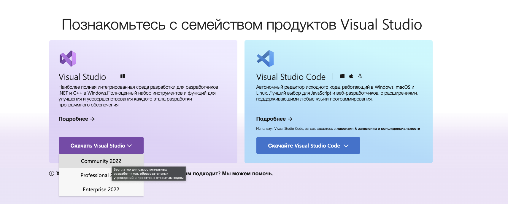

# Урок 2: Настройка среды разработки и первая программа

В этом уроке мы рассмотрим, как настроить среду разработки для языка программирования C# на операционной системе Windows, а также создадим нашу первую программу.

## Настройка среды разработки на Windows

Для разработки на C# одной из наиболее популярных и мощных сред является Visual Studio. В этом разделе мы пройдем через процесс установки Visual Studio и подготовки её к работе с C#.

### Шаг 1: Скачивание Visual Studio

1. Перейдите на официальный сайт [Visual Studio](https://visualstudio.microsoft.com/). Будьте внимательны, скачивайте приложение только с официального сайта!
2. Выберите версию Visual Studio Community, которая является бесплатной для индивидуального использования и малого бизнеса.
3. Нажмите на кнопку "Скачать" для начала загрузки установочного файла.



### Шаг 2: Установка Visual Studio

1. Запустите скачанный установочный файл.
2. В установщике выберите "ASP.NET и разработка веб-приложений" и "Разработка классических приложений .NET" для установки необходимых компонентов для C#.
3. Дождитесь окончания процесса установки.

### Шаг 3: Создание первого проекта

1. Откройте Visual Studio.
2. Выберите "Создать новый проект".
3. В категориях выберите "Консольное приложение" для C#.
4. Укажите название проекта и место его сохранения.
5. Нажмите "Создать".

## Создание первой программы на C#

Теперь, когда у вас настроена среда, давайте напишем нашу первую программу на C#.

### Программа "Hello World"

```csharp
using System;

namespace HelloWorld
{
    class Program
    {
        static void Main(string[] args)
        {
            Console.WriteLine("Hello World!");
            Console.ReadLine(); // Ждем нажатия клавиши Enter, чтобы консоль не закрылась сразу
        }
    }
}
```

### Шаги для запуска программы

1. В Visual Studio в редакторе кода вставьте код, указанный выше.
2. Нажмите на кнопку "Запустить" на панели инструментов или используйте сочетание клавиш F5 для компиляции и выполнения программы.
3. В открывшемся окне консоли вы увидите вывод "Hello World!".

## Заключение

Теперь вы знаете, как настроить среду разработки для C# на Windows и создать вашу первую программу. Эти навыки станут фундаментом для всех будущих проектов на C#, которые вы будете разрабатывать в ходе нашего курса.

Этот урок предоставляет все необходимые шаги для начала работы с C# в среде Visual Studio, от установки до успешного выполнения первой программы.

## Навигатор

- [На главную](../index.md)
- [Следующая  лекция](../B02_L01_Syntax/README.md)